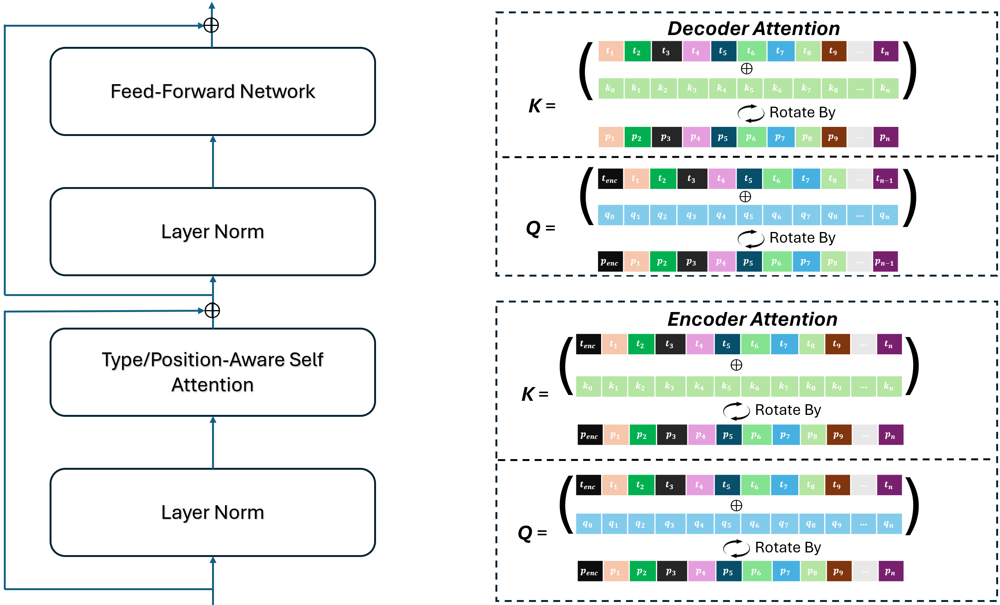
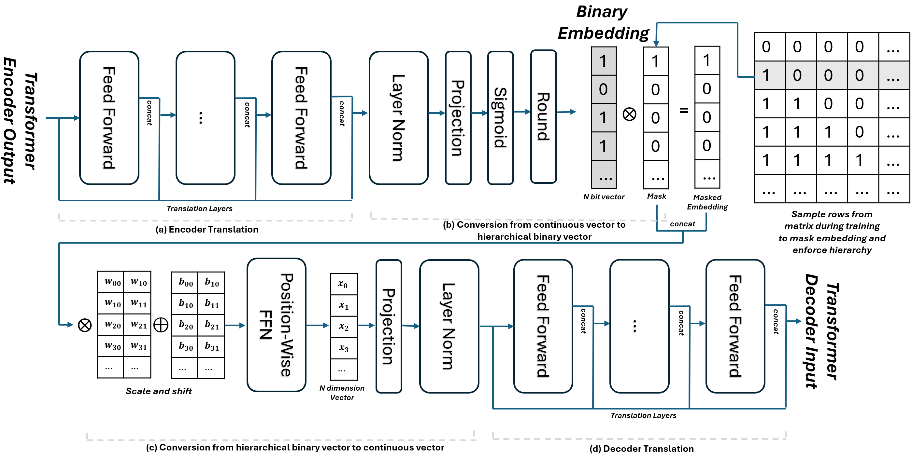
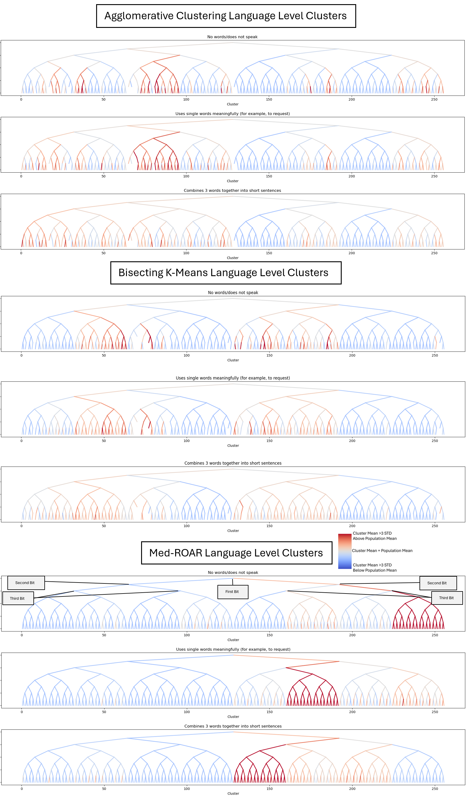
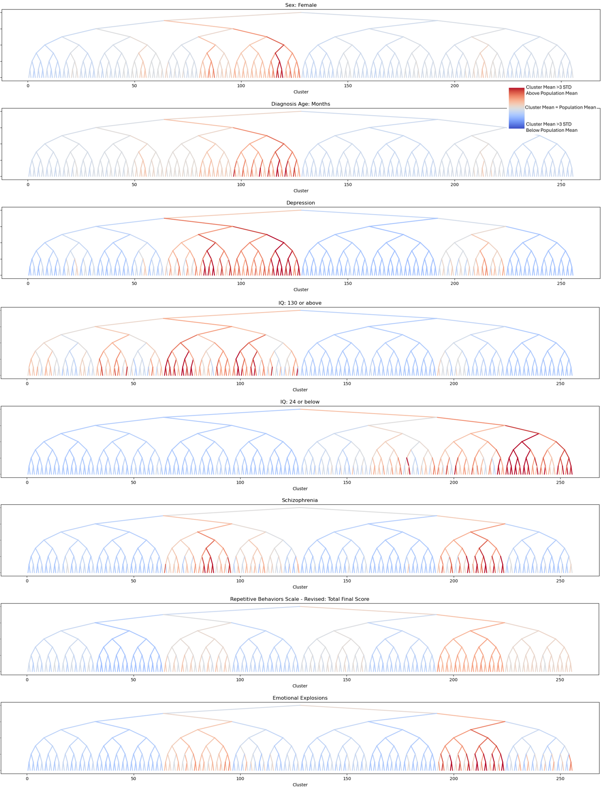

# MedROAR
MedROAR is multi-modal embedding model for medical records which hierarchically clusters patients based on whatever records are avalible at the time. It is intended to identify what clinical subgroup a patient falls into without requiring comprehensive patient records which may not be avalible. Identifying a patient's clinical subgroup allows for improved personalized treatment which can improve clinical outcomes.

# Description
MedROAR is a transformer-based autoencoder intended for use with tabular and time-series medical records. It produces hierarchical binary embeddings. This naturally identifies subgroups of patients who share high-level similarities. It utilizes a Random Order AutoRegressive (ROAR) decoder to learn complex dependencies between different types of records. MedROAR features specialized modifications to allow it to better handle the unique requirements inherent to medical records, specifically temporal sparseness and the large number of different record types.

# Architecture Details
ChemROAR uses a modified position and type aware self-attention operation. This allows it to handle random order modeling of mixed-type data. Each token is represented as a triplet comprising a Type, Position, and Value, which allows multiple data modalities to be incorporated into a single context without necessitating architectural changes or an overly large vocabulary. MedROAR combines tabular patient information and time-series timelines of patient records in the same self-attention operation during training.

The encoder produces a hierarchical binary embedding where each additional bit seeks to improve the decoders predictions by as much as possible. This semantically partitions patients into a binary tree where each bifurcation represents some high-level difference between their clinical status. Nodes in this tree are clusters. Higher-level clusters capture broader, less specific traits and contain more patients, whereas lower-level clusters focus on detailed, specific criteria but contain fewer patients. Each cluster is discrete and therefore well defined, enabling the use of conventional statistical methods to quantify uncertainty and calculate confidence intervals for the properties of each patient subgroup.

# Tabular Data Only: MedROAR vs Agglomerative Clustering Using Patient Information From the SPARK Autism Dataset
### MedROAR's learning objective allows it to find patients clustered by high-level similarity. This typically produces more cohesive clusters than distance based methods.

### More Autism Phenotype Subgroups

# Resilience to Missing Information: Mixed Time-Series and Tabular EHR Data
### MedROAR is designed to accurately identify patient subgroup using however much patient information is avalible. Note the similarities between clusters identified using only the first hour of patient data after admission and the first eight hours.

# Usage
See [data preparation](data_prepare.ipynb) and [MedROAR training/usage](MedROAR_demo.ipynb) demo notebooks for an illustrated version of how to prepare data, train, and run MedROAR models. The demo notebook uses MIMIC-IV. You will need to request access for this yourself and download the .zip
